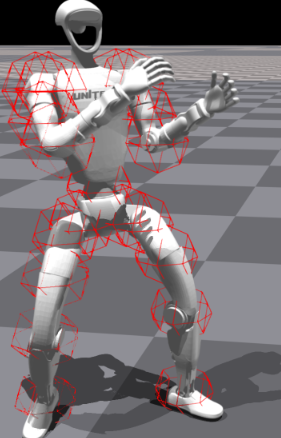

# I. 如何重定向进入以下路径：
```
cd H2O/human2humanoid-main/scripts/main_zsy
```
我把主要用到的文件进行了梳理，放到了main_zsy文件夹下，里面有：
```
.
├── data_amass
│   └── g1
│       └── ACCAD_g1_stand1.pkl
├── data_smpl
│   └── g1
│       └── shape_optimized_g1_male.pkl
├── __init__.py
├── process_amass.py
├── process_smpl.py
├── process_vis.py
├── __pycache__
│   ├── __init__.cpython-38.pyc
│   ├── process_amass.cpython-38.pyc
│   ├── process_smpl.cpython-38.pyc
│   └── process_vis.cpython-38.pyc
└── README.txt
```
## 1，运行process_smpl.py会将蒙皮和机器人进行重定向，保存到data_smpl文件夹下；
```
python process_smpl.py
```

## 2，运行process_amass.py会将motion和机器人进行重定向，保存到data_amass文件夹下；
```
python process_amass.py
```

## 3，运行process_vis.py会可视化motion，当然，这个可能会让机器人浮在空中，因为是忽略物理引擎的。
```
python process_vis.py
```



## 4,动捕数据集
路径：
```
H2O/human2humanoid-main/data/AMASS/
```
文件结构，可以自行去瓦网站下载。。。
```
.
└── AMASS_Complete
    ├── ACCAD
    ├── BMLhandball
    ├── BMLmovi
    ├── BMLrub
    └── CMU
    ......

```

# II 运行RL
详细见：https://github.com/LeCAR-Lab/human2humanoid/tree/main
