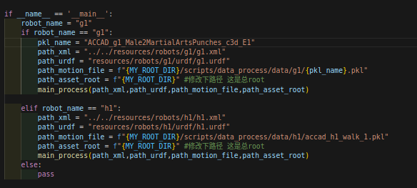
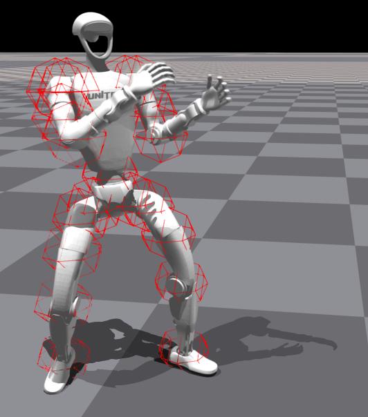
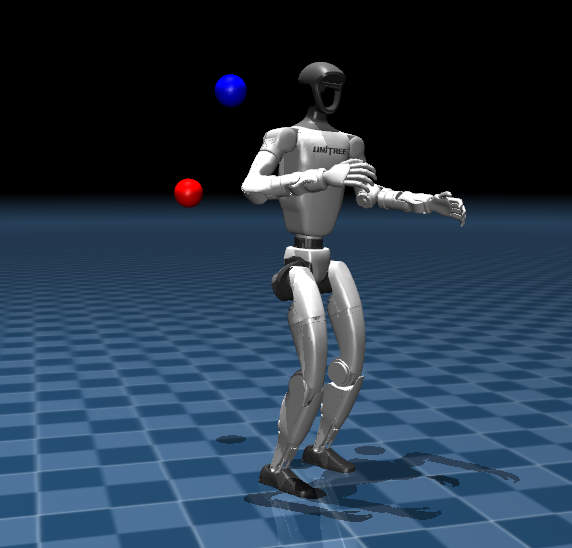

# H2O or OmniH2O
本工程包括重定向部分和T-S训练两个部分，前者用于机器人和人体模板相匹配，便于训练，后者用于教师网络和学生网络的蒸馏。

一些细节或者issues等可以对应参考：

https://www.cnblogs.com/myleaf/p/18715051

https://www.cnblogs.com/myleaf/p/18727733

本工程的目录结构为：
```
.
├── H2O
├── H2O_install_pkgs
├── H2O_real
├── H2O_Success_Model
├── H2O.xmind
├── Images
└── README.md

```

|name|descriptions|
| --- | --- |
|H2O|isaac gym训练环境|
|H2O_install_pkgs|PHC等安装包|
|H2O_real|mujoco sim2sim的脚本或者sim2real的SDK（G1）|
|H2O_Success_Model|训练好的模型，可直接导入运行|
|H2O.xmind|结构|
|README.md|--|
| --- | --- |

H2O文件夹的目录结构为：
```
.
├── human2humanoid-main
│   ├── data
│   ├── hahhaahah
│   ├── hardware_code
│   ├── legged_gym
│   ├── requirements.txt
│   ├── resources
│   ├── rsl_rl
│   └── scripts
└── IsaacGym_Preview_4_Package
    └── isaacgym
```
H2O主要包含：
|name|descriptions|
| --- | --- |
|data | 数据集，里面有AMASS数据集和SMPL数据集；|
|hardware_code | 一些硬件的代码C++（原始开源，忽视即可）；
|legged_gym | ETH；
|phc | 重定向部分，里面有AMASS和SMPL数据集的重定向部分；
|rsl_rl | ppo算法
|scripts | 处理phc的脚本，里面有重定向的脚本，以及可视化的脚本；
|resources | 机器人文件，包含G1和H1，其中G1是19个自由度的，请使用g1.urdf和g1.xml，其他忽视即可，有别于legged_gym里的resources，这个单独用于phc处理，不过二者xml和urdf均相同。

## 安装依赖：
具体请参考原作者的安装
### 1.0 基础环境配置 pytorch
**NOTE： 使用conda或者python创建环境，不要在global下pip 包**
```bash
pip install --upgrade pip
pip install torch==2.1.0 torchvision==0.16.0 torchaudio==2.1.0
pip install numpy==1.23.5
```
### 1.1 安装PHC

其中smplsim_package是phc的依赖，如果安不上可以手动安装,里面包含了两个pkg，安装方法为：

```bash
[step 1]
cd H2O/smplsim_package/smplx-master/
pip install -e .
```

```bash
[step 2]
cd H2O/smplsim_package/SMPLSim-master/
pip install -e .
pip install -r requirement.txt
```

```bash
[step 3]
cd H2O/human2humanoid-main/phc/
pip install -e .
```
### 1.2 安装IsaacGym
```bash
[step 4]
cd H2O/IsaacGym_Preview_4_Package/isaacgym/python/
pip install -e .
```

### 1.3 安装rsl_rl
```bash
[step 5]
cd H2O/human2humanoid-main/rsl_rl/
pip install -e .
```


### 1.4 安装human2humanoid-gym
```bash
[step 6]
cd H2O/human2humanoid-main/legged_gym
pip install -e .
```
### 1.5 unitree_sdk2_python
```bash
git clone https://github.com/unitreerobotics/unitree_sdk2_python.git
cd unitree_sdk2_python
pip3 install -e .
```
如果遇到问题：
```bash
Could not locate cyclonedds. Try to set CYCLONEDDS_HOME or CMAKE_PREFIX_PATH
```
参考: https://github.com/unitreerobotics/unitree_sdk2_python

### 1.6  mujoco-python
```bash
pip install mujoco
```

## 使用说明
### 1.1 重定向(retargeted) 

进入以下路径：
```
cd H2O/human2humanoid-main/scripts/main_zsy
ls
```
我把主要用到的文件进行了梳理，放到了main_zsy文件夹下，包含以下文件：
```
.
├── data_amass
│   └── g1
│       └── ACCAD_g1_stand1.pkl
├── data_smpl
│   └── g1
│       └── shape_optimized_g1_male.pkl
├── __init__.py
├── process_amass.py
├── process_smpl.py
├── process_vis.py
├── process_vis_for_filter.py
```
- process_smpl.py   ：  机器人蒙皮 retarget
- process_amass.py  ：  机器人motion retarget
- process_vis.py    ：   可视化动作
- process_vis_for_filter.py : 用于手动筛选不合理动作（比如翻跟头、侧空翻、肘击等）

#### 1.1.1，运行process_smpl.py会将蒙皮和机器人进行重定向，保存到data_smpl文件夹下；
```
python process_smpl.py
```

#### 1.1.2，运行process_amass.py会将motion和机器人进行重定向，保存到data_amass文件夹下；
```
python process_amass.py
```

#### 1.1.3，运行process_vis.py会可视化motion，当然，这个可能会让机器人浮在空中，因为是忽略物理引擎的。
```
python process_vis.py
```

路径等按照__main__下的形式修改即可：这里不再赘述





## 1.2 动捕数据集
```
cd H2O/human2humanoid-main/data/
```
目录结构为：
```
.
├── AMASS
│   └── AMASS_Complete
│       ├── ACCAD
│       ├── BMLhandball
│       ├── BMLmovi
│       ├── BMLrub
│       ├── CMU
│       ├── DanceDB
│       ├── EKUT
│       ├── HumanEva
│       └── Transitions
├── smpl
│   ├── SMPL_FEMALE.pkl
│   ├── SMPL_MALE.pkl
│   └── SMPL_NEUTRAL.pkl
└── smpl_zip
    └── SMPL_python_v.1.1.0.zip

```

## 1.3 训练

> [X] 其实特别理解不了的是作者为什么用hydra，还要把每一个config的子class分成一个个的yaml文件，然后控制台配置一大堆参数。深受其害，故我索性把配置参数作为注释的形式写在了脚本里，使用时复制粘贴即可。
>
> [X] 编写为bash 脚本，只需要在scripts目录下运行:
> ```bash
> chmod +x sh_train_hydra/sh_play_hydra.sh  # 添加权限
> ./sh_train_hydra/sh_play_hydra.sh # 运行
> ```
```
# 在h2o目录下
cd H2O/human2humanoid-main/legged_gym
```
### 1.3.1 训练教师网络：

运行train_hydra.py 
```bash
# 设置变量NAME=“T”
chmod +x sh_train_hydra.sh  # 添加权限
./sh_train_hydra.sh # 运行
```
运行play_hydra.py  
```bash
# 设置变量NAME=“T”
chmod +x sh_play_hydra.sh  # 添加权限
./sh_play_hydra.sh # 运行
```
### 1.3.2 蒸馏学生网络：

运行train_hydra.py
```bash
# 设置变量NAME=“S”
chmod +x sh_train_hydra.sh  # 添加权限
./sh_train_hydra.sh # 运行
```

运行play_hydra.py  
```bash
# 设置变量NAME=“S”
chmod +x sh_play_hydra.sh  # 添加权限
./sh_play_hydra.sh # 运行
```

更加详细内容见作者github：https://github.com/LeCAR-Lab/human2humanoid/tree/main

## 1.4 sim2sim
按照以下步骤运行，确保安装了mujoco
```bash
cd /your-installed-path/H2O_git_1/h2o/H2O_real/mujoco_sim2sim/scripts/
python sim2sim.py
```


## 1.5 sim2real
按照以下步骤运行，确保安装了G1的SDK
```bash
cd /your-installed-path/H2O_git_1/h2o/H2O_real/mujoco_sim2real/scripts/
python sim2real.py
```